# Advanced Lane Line Detection

The goal of this project was to identify the lane line markings of the ego-lane using camera images.
To achieve this, the following steps were performed:

* Camera calibration (distortion correction) 
* Perspective transformation to achieve a "birds-eye view" of the road
* Lane line pixel detection and polynomial fitting to find the lane boundary
* Determining the curvature of the lane and the lateral vehicle position with respect to the lane center
* Overlaying the detected lane onto the original camera image 

All of the code for completing this project is contained in [this jupyter notebook](https://github.com/Corni33/CarND_P4_AdvancedLaneLines/blob/master/advanced_lane_lines.ipynb).

## Camera Calibration

To compensate for distortion effects (e.g. radial or tangential distortion) introduced by the camera lense a series of calibration images showing a calibration pattern (chessboard pattern) was has been provided.
After detecting the corners of the chessboard pattern in multiple images, OpenCV's calibrateCamera() function is used to calculate the distorition coefficients (notebook cell 3).
These coefficients then get used to define a function for undistorting camera images (notebook cell 4):

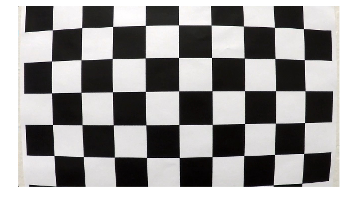 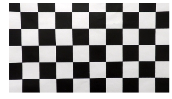 

The left image has not been edited while the right image has been corrected for lense distortion.

## Perspective Transformation

The detection of lane lines is much easier when looking at the road from a birds-eye-view.
To achieve this view a perspective transformation gets applied to the camera image.
Cells 5, 6 and 7 of the notebook provide the user with the opportunity to draw a transformed rectangle onto a camera image which corresponds to a normal rectangle in a birds-eye-view.
The coordinates of the rectangle corners are then used to calculate a perspective transformation matrix (cell 6).
Images can now be transformed ('warped') to and back from a birds-eye-view using the functions defined in cell 7 of the notebook. 

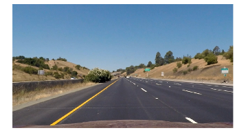 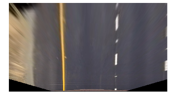 

## Lane Line Detection

The warped camera image serves as a basis for detecting pixels which are likely part of a lane line before fitting a polynomial to get a functional description of each lane line. 
The following image serves as an example for visualizing the whole lane line detection pipeline (left: distortion corrected image, right: image warped into birds-eye-view):

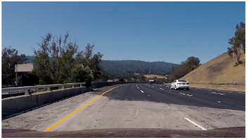 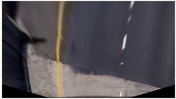 

### Edge Detection

After converting the image to grayscale, edge detection is performed separately in x- and y-direction by always convolving the image with a sobel kernel that simultaneously smooths the image (cell 10).
Afterwards a sobel binary image is created via thresholding, that only contains ones (shown as white areas in the image) at the locations where there is a large gradient in x-direction and a small gradient in y-direction (cell 10):

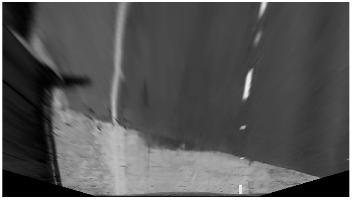 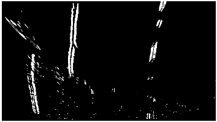 

### Color Channel Thresholding

The warped (birds-eye-view) color image gets converted to HLS color space where a threshold is applied to the S-channel (left image).
Another color threshold is applied to the R-channel of the warped color image in BGR color space (middle image). 
The two resulting binary images get combined via logical "AND" operation to yield a common binary image (right image). The code for these operations is contained in cell 10 of the notebook.

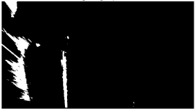  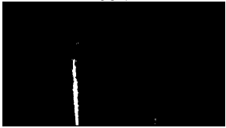 

### Combination of Edge and Color Information

The binary image from color thresholding now gets combined with the binary image from edge detection via logical "OR" (cell 10).
The result of this operation is a single binary image containing ones where we expect either lane line edges or the lane line marking itself to be (left image).
Unfortunately most images contain other features that get misclassified as being part of the lane lines (e.g. road border, parts of other vehicles, ...) when applying the above thresholding logic.
In a first attempt to improve on this situation small isolated spots get removed by applying a morphological opening operation (right image):

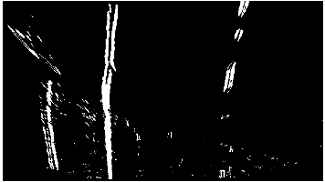 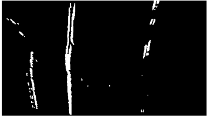

### Line Area Masking

To get a better estimate of which pixels belong to the left and right lane line respectively, the binary image now gets masked (by applying logical "AND") with a distinct lane line mask for each lane line (cell 10).
A lane line mask contains an area estimate for where the lane line might be now given that we know where it was in the last frame that has been processed. The lane line masks might look something like this:

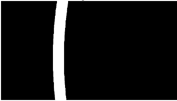 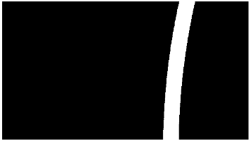

### Polynomial Fitting

All the white pixels of each lane line binary image now get used as data points for fitting a parabola. 
To make this fit more robust against outliers the RANSAC algorithm gets used instead of standard least squares polynomial fitting (cell 8).
The results of this step are two sets of polynomial coefficients describing each lane line in a functional form.

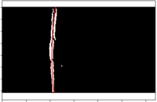 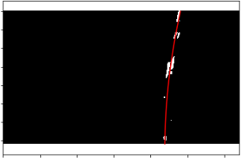

From the polynomial coefficients the curvature of the lane at the vehicles current position as well as the vehicles lateral offset to the lane center can now be caluclated (cell 8). 
The polynomial additionally gets used to generate the lane mask for the next frame (cell 11). In the very first frame of a video the masks get initialized with a rough estimate of the lane line positions.

### Lane Overlay 

After the lane lines have been identified in the warped image the lane in the original image gets highlighted by 'unwarping' the polynomial's points and using them as boundary points for a lane polygon (cell 9). 
The values of curvature and lateral offset are filtered by a low pass filter and then also displayed in the image:

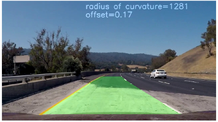 

## Video Processing

Now that individual images can be processed the pipeline gets applied to a series of images from a video stream (cell 13).
Here's a [link to the resulting video](./output.mp4) (converted to .mp4).

## Discussion

The developed pipeline works quite well on the provided project video as can be seen in the video result. 
On the challenge video however the lane line detection method sometimes performs poorly because it either considers the wrong structures as lane lines (e.g. asphalt grooves) or doesn't recognize lane markings at all (e.g. because of poor lighting conditions).

One of the sources of this problem is the hardcoding of threshold values for detecting lane line edges and relevant lane line color regions.
As soon as lighting conditions change or the color of a lane line is slightly out of the expected range, lane line detection performance deteriorates quickly.
A possible solution for this problem would be to use adaptive thresholds based on appropriate metrics.

Another possible optimization for the developed pipeline is to use a better lane model. 
Instead of individually considering the left and right lane line, a single unifying lane model might be better suited e.g. to still keep track of the lane even when one lane line is missing completely.

The temporal tracking of a lane could be improved by utilizing the vehicles ego motion. 
In this way an acceptable estimate of the lane could still be provided even after losing the actual lane measurements over some frames of the video.

